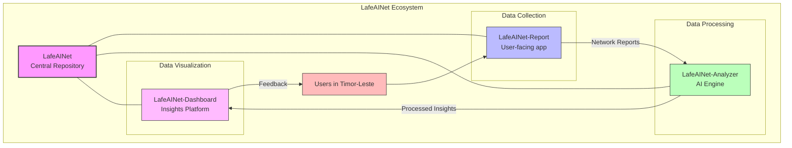
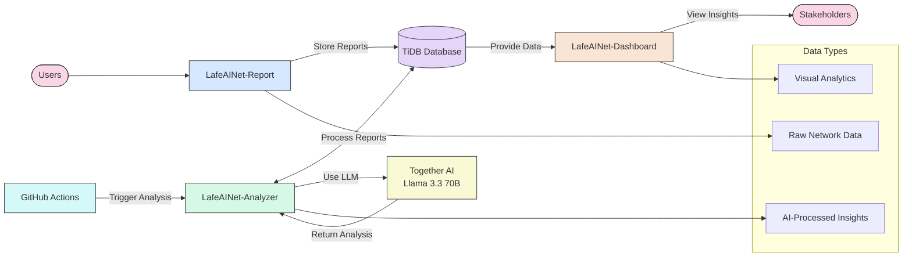
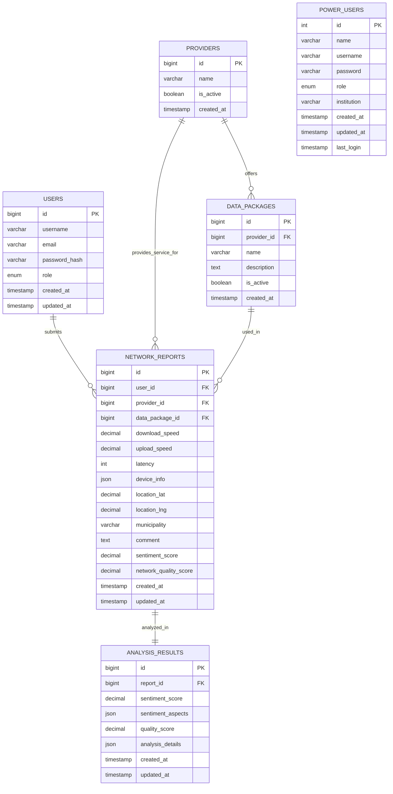

# 🌏 LafeAINet

<div align="center">


  <br>
  <strong>🏆 Submission for AI for Connectivity Hackathon II: Building Resilient Networks</strong>
</div>

<p align="center">
  <a href="/app.png" target="_blank">
    
  </a>
</p>

<div align="center">
  <h3>AI-Powered Network Connectivity Monitoring Platform for Timor-Leste</h3>
</div>

## 👥 Lafaek AI Team

<div align="center">
      <a href="https://github.com/ajitonelsonn">
        
        <br />
        <sub><b>Ajito Nelson Lucio da Costa</b></sub>
      </a>
    </td>
</div>

## 🌟 About LafeAINet

LafeAINet is a comprehensive network monitoring platform designed specifically for Timor-Leste, a young nation facing significant connectivity challenges. Our solution empowers communities, telecommunications providers, and policymakers with data-driven insights to strengthen digital infrastructure where it's needed most.

The name "LafeAINet" combines "Lafe or Lafaek" (which means "Crocodile" in Tetum, a national language of Timor-Leste) with "AI" and "Net," symbolizing our mission to build trusted AI-powered network analysis for the nation.

### 💡 Why It Matters

In Timor-Leste, reliable connectivity is crucial but frequently inadequate:

- **Geographic Challenges**: Mountainous terrain creates natural connectivity barriers
- **Infrastructure Gaps**: Limited telecommunications infrastructure in rural areas
- **Investment Prioritization**: Need for data-driven decisions on infrastructure improvements
- **Service Accountability**: Limited visibility into provider performance across regions

LafeAINet addresses these challenges by creating a transparent, data-driven view of connectivity throughout the country.

## 🚀 The LafeAINet Ecosystem

LafeAINet consists of three interconnected applications that work together to collect, analyze, and visualize network quality data:



### Component Repositories

- **[LafeAINet-Report](https://github.com/ajitonelsonn/lafeainet-report)**: Mobile-friendly web application for collecting network quality reports from users across Timor-Leste
- **[LafeAINet-Analyzer](https://github.com/ajitonelsonn/lafeainet-analyzer)**: AI-powered backend that processes network data and generates meaningful insights using LLMs
- **[LafeAINet-Dashboard](https://github.com/ajitonelsonn/lafeainet-dashboard)**: Interactive visualization platform for exploring network quality data and trends

## 🌟 Core Features

<table>
  <tr>
    <td width="33%" align="center">
      <h3>📱 User-Friendly Reporting</h3>
      <p>Simple interface for submitting network quality reports from any device</p>
    </td>
    <td width="33%" align="center">
      <h3>🧠 AI-Powered Analysis</h3>
      <p>Llama 3.3 70B processing for sentiment and quality analysis</p>
    </td>
    <td width="33%" align="center">
      <h3>📊 Interactive Visualizations</h3>
      <p>Data-rich dashboard with maps, charts, and provider comparisons</p>
    </td>
  </tr>
  <tr>
    <td width="33%" align="center">
      <h3>🗺️ Geographic Mapping</h3>
      <p>Location-based visualization of network quality across regions</p>
    </td>
    <td width="33%" align="center">
      <h3>🔄 Automated Processing</h3>
      <p>Scheduled analysis of new reports via GitHub Actions</p>
    </td>
    <td width="33%" align="center">
      <h3>🔒 Secure Access Controls</h3>
      <p>Role-based permissions for viewing sensitive data</p>
    </td>
  </tr>
</table>

## 📊 Data Flow Architecture



## 💾 Database Structure

Our system utilizes a TiDB (MySQL-compatible) database with the following schema:



[View full database schema](database.sql)

## 🔧 Technology Stack

<table align="center">
  <tr>
    <td align="center"><strong>Frontend</strong></td>
    <td align="center"><strong>Backend</strong></td>
    <td align="center"><strong>AI & Data</strong></td>
    <td align="center"><strong>Infrastructure</strong></td>
  </tr>
  <tr>
    <td>
      • React 19<br>
      • Next.js 15<br>
      • TailwindCSS<br>
      • Chart.js / Leaflet
    </td>
    <td>
      • Next.js API Routes<br>
      • NextAuth.js<br>
      • MySQL2 client
    </td>
    <td>
      • Llama 3.3 70B<br>
      • Together AI SDK<br>
      • TiDB database
    </td>
    <td>
      • Render<br>
      • GitHub Actions<br>
      • Vercel
    </td>
  </tr>
</table>

## 🌟 Real-World Impact

LafeAINet helps solve critical connectivity challenges in Timor-Leste:

- **Informed Decision Making**: Policymakers can identify priority areas for infrastructure investment
- **Provider Accountability**: Transparent comparison of service provider performance
- **User Empowerment**: Citizens gain visibility into regional network quality
- **Infrastructure Planning**: Telecom companies can target improvements where needed most

## 🛠️ Getting Started with LafeAINet

### Prerequisites

- Node.js 20 or higher
- npm or yarn
- MySQL-compatible database (TiDB recommended)
- Together AI API key

### Installation Guide

1. Clone the complete ecosystem:

```bash
# Clone the main repository
git clone https://github.com/ajitonelsonn/LafeAINet.git
cd LafeAINet

# Clone the component repositories
git clone https://github.com/ajitonelsonn/lafeainet-report.git
git clone https://github.com/ajitonelsonn/lafeainet-analyzer.git
git clone https://github.com/ajitonelsonn/lafeainet-dashboard.git
```

2. Set up the database:

```bash
# Create the database schema using the provided SQL file
mysql -u youruser -p < database.sql
```

3. Configure each component (see individual repositories for detailed instructions)

## 🔒 Privacy & Security

LafeAINet is designed with privacy in mind:

- Anonymous report submission supported
- No personal identifying information required
- Geographic data collected only with permission
- Role-based access controls for sensitive data

## 📜 License

This project is licensed under the [MIT License](LICENSE).

---

<div align="center">
  <p>Built with 💙 for improving connectivity in Timor-Leste</p>
  <p>
    <a href="https://lablab.ai/event/ai-for-connectivity-hackathon-building-resilient-networks">AI for Connectivity Hackathon II</a>
    •
    <a href="https://github.com/ajitonelsonn/LafeAINet">View on GitHub</a>
  </p>
</div>
